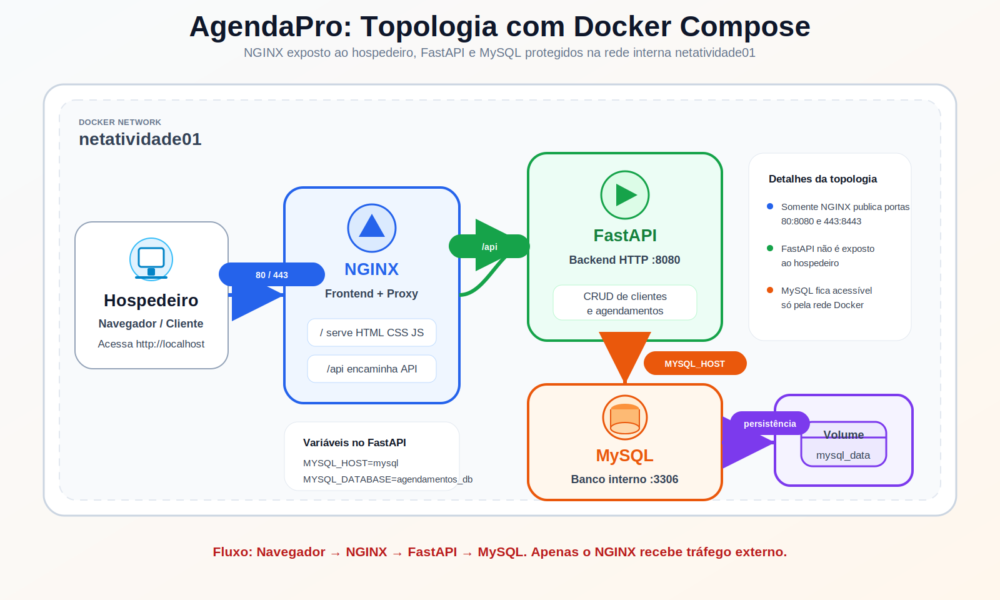

# AgendaPro — Sistema de Agendamentos

Aplicação web conteinerizada com Docker Compose para a disciplina **Serviços de Redes para Internet**. O projeto implementa o tema do **Grupo 5: Sistema de Agendamentos**, com CRUD de clientes e agendamentos.

## Integrantes

| Nome | Matrícula |
|------|-----------|
| Alessandro Mion Batista | 20241si001 |
| Andrey Magalhães Silva | 20241si032 |
| Miguel Santuchi Poleto | 20241si019 |

## Objetivo da Atividade

Demonstrar uma topologia com múltiplos serviços integrados por uma rede Docker própria:

- **NGINX** como único serviço exposto ao hospedeiro.
- **FastAPI** como backend HTTP, escutando na porta `8080` apenas dentro da rede Docker.
- **MySQL** como banco de dados persistente, acessível apenas pela rede interna.
- **Frontend estático** servido pelo NGINX na rota `/`.
- **Proxy reverso** encaminhando `/api` para a API FastAPI.

## Topologia



```text
Hospedeiro
  └── portas 80 e 443
        └── nginx_agendamentos
              ├── /      -> frontend estático
              └── /api   -> fastapi_agendamentos:8080
                               └── mysql_agendamentos:3306
```

Todos os containers estão conectados à rede `netatividade01`.

| Serviço | Container | Função | Porta interna | Porta no host |
|---------|-----------|--------|----------------|---------------|
| `nginx` | `nginx_agendamentos` | Frontend e proxy reverso | `8080`, `8443` | `80`, `443` |
| `fastapi` | `fastapi_agendamentos` | API CRUD | `8080` | não exposta |
| `mysql` | `mysql_agendamentos` | Banco de dados | `3306` | não exposta |

## Requisitos Atendidos

- Topologia mínima com `nginx`, `fastapi` e `mysql`.
- Rede Docker customizada chamada `netatividade01`.
- MySQL com usuário comum `agendamento`.
- Senha do banco definida por variável de ambiente.
- Volume Docker para persistência do MySQL.
- FastAPI depende do MySQL saudável antes de iniciar.
- NGINX é o único serviço publicado no hospedeiro.
- Frontend consome a API por `/api`.
- CRUD completo de duas entidades relacionadas: `clientes` e `agendamentos`.
- Healthcheck no MySQL.
- HTTPS local com certificado autoassinado gerado no build do NGINX.

## Estrutura

```text
sistema-de-agendamento/
├── docker-compose.yml
├── .env.example
├── README.md
├── backend/
│   ├── Dockerfile
│   ├── requirements.txt
│   └── app/
│       ├── main.py
│       ├── database.py
│       ├── models.py
│       ├── routes/
│       │   ├── clientes.py
│       │   └── agendamentos.py
│       └── schemas/
│           ├── cliente.py
│           └── agendamento.py
└── nginx/
    ├── Dockerfile
    ├── nginx.conf
    └── html/
        ├── index.html
        ├── style.css
        └── script.js
```

## Variáveis de Ambiente

Crie o arquivo `.env` a partir do exemplo:

```bash
cp .env.example .env
```

Conteúdo esperado:

```env
MYSQL_USER=agendamento
MYSQL_PASSWORD=20241si000
MYSQL_DATABASE=agendamentos_db
```

Use como `MYSQL_PASSWORD` a matrícula de um integrante do grupo.

## Como Executar

Suba toda a topologia com:

```bash
docker compose up --build
```

Ou em segundo plano:

```bash
docker compose up --build -d
```

Acesse:

- Frontend: `http://localhost`
- Frontend com HTTPS local: `https://localhost`
- Swagger/FastAPI: `http://localhost/api/docs`
- Health check da API: `http://localhost/api/`

O navegador pode alertar que o certificado HTTPS é autoassinado. Isso é esperado em ambiente local.

Para parar sem apagar os dados:

```bash
docker compose down
```

Para parar e apagar o volume do banco:

```bash
docker compose down -v
```

Se sua instalação do Docker Compose apresentar erro interno relacionado ao Bake durante o build, rode:

```bash
COMPOSE_BAKE=false docker compose up --build
```

Com Docker via `sudo`, use:

```bash
sudo env COMPOSE_BAKE=false docker compose up --build
```

## Dados Iniciais

Quando o banco está vazio, o backend cria automaticamente 3 clientes e alguns agendamentos de exemplo. Isso facilita a demonstração em sala, porque a interface já abre com registros para listar, editar e remover.

Essa carga é idempotente: se já existir pelo menos um cliente no banco, ela não cria dados novamente.

Também existe a tela **Popular banco** na parte inferior da barra lateral. Ela oferece opções para criar mais dados de demonstração, como 10 clientes com 5 agendamentos ou 20 clientes com 10 agendamentos.

## Endpoints

### Clientes

| Método | Rota | Descrição |
|--------|------|-----------|
| `GET` | `/api/clientes/` | Lista clientes |
| `GET` | `/api/clientes/{id}` | Busca um cliente |
| `POST` | `/api/clientes/` | Cria cliente |
| `PUT` | `/api/clientes/{id}` | Atualiza cliente |
| `DELETE` | `/api/clientes/{id}` | Remove cliente e seus agendamentos |

### Agendamentos

| Método | Rota | Descrição |
|--------|------|-----------|
| `GET` | `/api/agendamentos/` | Lista agendamentos |
| `GET` | `/api/agendamentos/?status=pendente` | Filtra por status |
| `GET` | `/api/agendamentos/?cliente_id=1` | Filtra por cliente |
| `GET` | `/api/agendamentos/{id}` | Busca um agendamento |
| `POST` | `/api/agendamentos/` | Cria agendamento |
| `PUT` | `/api/agendamentos/{id}` | Atualiza agendamento |
| `DELETE` | `/api/agendamentos/{id}` | Remove agendamento |

## Exemplos com `curl`

Criar cliente:

```bash
curl -X POST http://localhost/api/clientes/ \
  -H "Content-Type: application/json" \
  -d '{"nome":"João Silva","email":"joao@email.com","telefone":"(63) 99999-0001"}'
```

Listar clientes:

```bash
curl http://localhost/api/clientes/
```

Criar agendamento:

```bash
curl -X POST http://localhost/api/agendamentos/ \
  -H "Content-Type: application/json" \
  -d '{
    "cliente_id": 1,
    "servico": "Consulta inicial",
    "data_hora": "2026-05-20T14:00:00",
    "status": "pendente",
    "observacoes": "Primeiro atendimento"
  }'
```

Atualizar agendamento:

```bash
curl -X PUT http://localhost/api/agendamentos/1 \
  -H "Content-Type: application/json" \
  -d '{"status":"confirmado"}'
```

Remover agendamento:

```bash
curl -X DELETE http://localhost/api/agendamentos/1
```

## Pontos Para Explicar na Apresentação

- O NGINX é o único container exposto ao hospedeiro, atendendo a exigência de isolamento.
- O backend não usa `localhost` para acessar o banco; usa o nome do serviço `mysql`, resolvido pela rede Docker.
- O `depends_on` com `condition: service_healthy` faz o FastAPI aguardar o MySQL aceitar conexões.
- O volume `mysql_data` mantém os dados mesmo após `docker compose down`.
- A rota `/api` no NGINX remove a necessidade de expor a porta do FastAPI.
- As entidades possuem relacionamento: um cliente pode ter vários agendamentos.
