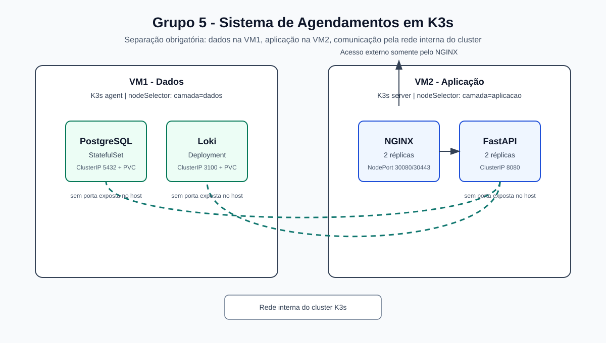

# AgendaPro — Sistema de Agendamentos

Aplicação web do **Grupo 5** para a disciplina **Serviços de Redes para Internet**. O projeto implementa um sistema de agendamentos com CRUD de `clientes` e `agendamentos`, usando **NGINX + FastAPI + PostgreSQL** e orquestração em cluster com **K3s**.

## Integrantes

| Nome | Matrícula |
|------|-----------|
| Alessandro Mion Batista | 20241si001 |
| Andrey Magalhães Silva | 20241si032 |
| Miguel Santuchi Poleto | 20241si019 |

## Orquestrador

O orquestrador utilizado é o **K3s**, distribuição leve de Kubernetes indicada para laboratório, edge e ambientes com poucos recursos.

O cluster mínimo da atividade usa duas VMs:



```text
VM1 - camada de dados - K3s agent
  PostgreSQL 5432 - ClusterIP, sem porta no host
  Loki 3100      - ClusterIP, sem porta no host

VM2 - camada de aplicacao - K3s server
  FastAPI 8080   - ClusterIP, sem porta no host
  NGINX 80/443   - NodePort 30080/30443, unico acesso externo
  Grafana 3000   - NodePort 30300, desafio extra
```

Os manifests ficam em [`k8s/`](/home/bolsistanovo/Área de trabalho/sistema-de-agendamento/k8s) e usam `nodeSelector` para fixar os pods:

| Serviço | Recurso Kubernetes | Réplicas | Nó obrigatório |
|---------|--------------------|----------|----------------|
| PostgreSQL | StatefulSet | 1 | `camada=dados` |
| Loki | Deployment | 1 | `camada=dados` |
| FastAPI | Deployment | 2 | `camada=aplicacao` |
| NGINX | Deployment | 2 | `camada=aplicacao` |
| Grafana | Deployment | 1 | `camada=aplicacao` |

## Estrutura

```text
sistema-de-agendamento/
├── backend/
│   ├── Dockerfile
│   ├── requirements.txt
│   └── app/
│       ├── main.py
│       ├── database.py
│       ├── logger.py
│       ├── models.py
│       ├── routes/
│       └── schemas/
├── k8s/
│   ├── 00-namespace.yaml
│   ├── 01-secret-postgres.yaml
│   ├── 02-configmaps.yaml
│   ├── 03-pvcs.yaml
│   ├── 04-postgres.yaml
│   ├── 05-loki.yaml
│   ├── 06-fastapi.yaml
│   ├── 07-nginx.yaml
│   ├── 08-ingress.yaml
│   ├── 09-grafana.yaml
│   └── kustomization.yaml
├── loki/
│   └── loki-config.yaml
├── nginx/
│   ├── Dockerfile
│   ├── nginx.conf
│   └── html/
└── docker-compose.yml
```

## Variáveis Locais

Para testar com Docker Compose, crie ou ajuste `.env`:

```env
POSTGRES_USER=agendamento
POSTGRES_PASSWORD=20241si019
POSTGRES_DB=agendamentos_db
```

No K3s, essas credenciais ficam no Secret [`k8s/01-secret-postgres.yaml`](/home/bolsistanovo/Área de trabalho/sistema-de-agendamento/k8s/01-secret-postgres.yaml).

## Teste Local Com Compose

```bash
docker compose up --build -d
```

Acesse:

- Frontend: `http://localhost`
- Swagger/FastAPI: `http://localhost/api/docs`
- Health check: `http://localhost/api/`

Parar sem apagar dados:

```bash
docker compose down
```

Parar apagando volumes:

```bash
docker compose down -v
```

Se o PostgreSQL local acusar senha inválida ou versão incompatível, provavelmente existe um volume antigo na máquina. Para um teste limpo de laboratório, pare e recrie apagando os volumes:

```bash
docker compose down -v
docker compose up --build -d
```

Se a porta `80` já estiver em uso no hospedeiro, altere temporariamente o mapeamento do serviço `nginx` no `docker-compose.yml` ou pare o serviço local que está usando essa porta.

## Provisionamento Das VMs

Exemplo de endereços usados nos comandos abaixo:

```text
VM1 dados:      192.168.56.11
VM2 aplicacao:  192.168.56.12
```

As duas VMs precisam estar na mesma rede e conseguir se comunicar entre si.

Distribuição recomendada para as duas VMs: **Ubuntu Server 24.04 LTS**. Ela é leve, tem suporte longo, é bem documentada e funciona sem ajustes especiais com K3s, Docker e VirtualBox/KVM. Se as VMs tiverem pouca memória, **Debian 12 minimal** também é uma ótima opção.

Na **VM2**, instale o K3s server:

```bash
curl -sfL https://get.k3s.io | sh -
sudo kubectl get nodes
sudo cat /var/lib/rancher/k3s/server/node-token
```

Na **VM1**, instale o K3s agent usando o token da VM2:

```bash
curl -sfL https://get.k3s.io | K3S_URL=https://192.168.56.12:6443 K3S_TOKEN=<TOKEN_DA_VM2> sh -
```

Na **VM2**, rotule os nós:

```bash
sudo kubectl get nodes -o wide
sudo kubectl label node <NOME_DO_NODE_VM1> camada=dados
sudo kubectl label node <NOME_DO_NODE_VM2> camada=aplicacao
sudo kubectl get nodes --show-labels
```

## Imagens Da Aplicação

Os manifests usam imagens locais:

```text
agenda-fastapi:1.0
agenda-nginx:1.0
```

Na **VM2**, dentro do repositório:

```bash
docker build -t agenda-fastapi:1.0 ./backend
docker build -t agenda-nginx:1.0 ./nginx
docker save agenda-fastapi:1.0 -o agenda-fastapi.tar
docker save agenda-nginx:1.0 -o agenda-nginx.tar
sudo k3s ctr -n k8s.io images import agenda-fastapi.tar
sudo k3s ctr -n k8s.io images import agenda-nginx.tar
```

Como o FastAPI e o NGINX são fixados na VM2, as imagens locais precisam existir nesse nó. Se publicar no Docker Hub, altere `image:` em [`k8s/06-fastapi.yaml`](/home/bolsistanovo/Área de trabalho/sistema-de-agendamento/k8s/06-fastapi.yaml) e [`k8s/07-nginx.yaml`](/home/bolsistanovo/Área de trabalho/sistema-de-agendamento/k8s/07-nginx.yaml).

## Deploy No K3s

Na **VM2**, aplique todos os manifests:

```bash
sudo kubectl apply -k k8s/
```

Verifique o estado:

```bash
sudo kubectl get pods -n agendamentos -o wide
sudo kubectl get svc -n agendamentos
sudo kubectl get pvc -n agendamentos
```

O acesso externo ao sistema fica apenas pelo NGINX:

```bash
curl http://192.168.56.12:30080/api/
```

No navegador:

```text
http://192.168.56.12:30080
https://192.168.56.12:30443
```

## Desafio Extra: Ingress Com Traefik

O K3s já instala o Traefik por padrão. O manifesto [`k8s/08-ingress.yaml`](/home/bolsistanovo/Área de trabalho/sistema-de-agendamento/k8s/08-ingress.yaml) cria um Ingress para o host `agenda.local`.

Na máquina que vai acessar o navegador, adicione no arquivo `hosts`:

```text
192.168.56.12 agenda.local
```

No Linux, edite `/etc/hosts` com `sudo`. No Windows, edite `C:\Windows\System32\drivers\etc\hosts` como administrador.

Depois acesse:

```text
http://agenda.local
```

Verifique o Ingress:

```bash
sudo kubectl get ingress -n agendamentos
sudo kubectl describe ingress agenda-ingress -n agendamentos
```

## Desafio Extra: Grafana

O manifesto [`k8s/09-grafana.yaml`](/home/bolsistanovo/Área de trabalho/sistema-de-agendamento/k8s/09-grafana.yaml) sobe o Grafana na VM2 e já provisiona o Loki como datasource.

Acesse:

```text
http://192.168.56.12:30300
```

Credenciais:

```text
usuario: admin
senha: admin
```

No Grafana, abra **Explore**, selecione **Loki** e consulte:

```logql
{service="fastapi"}
```

## Logs Centralizados Com Loki

O arquivo de configuração do Loki está em [`loki/loki-config.yaml`](/home/bolsistanovo/Área de trabalho/sistema-de-agendamento/loki/loki-config.yaml) e também é aplicado no cluster via ConfigMap.

O backend envia ao Loki:

- inicialização da aplicação;
- cada requisição recebida, com método, rota e código HTTP;
- erros de conexão com o PostgreSQL.

Como o Loki é `ClusterIP`, ele não fica exposto fora do cluster. Para consultar durante a entrevista, use `port-forward` na VM2:

```bash
sudo kubectl -n agendamentos port-forward svc/loki 3100:3100
```

Em outro terminal:

```bash
curl http://localhost:3100/loki/api/v1/labels
```

Consultar logs do FastAPI dos últimos 10 minutos:

```bash
curl -G 'http://localhost:3100/loki/api/v1/query_range' \
  --data-urlencode 'query={service="fastapi"}' \
  --data-urlencode 'start='"$(date -d '10 minutes ago' +%s000000000)"'' \
  --data-urlencode 'end='"$(date +%s000000000)"''
```

## Comprovação Do Isolamento

Somente o Service `nginx` é `NodePort`:

```bash
sudo kubectl get svc -n agendamentos
```

Resultado esperado:

```text
fastapi    ClusterIP
postgres   ClusterIP
loki       ClusterIP
nginx      NodePort
```

PostgreSQL, Loki e FastAPI só são acessíveis pela rede interna do cluster. Para provar posicionamento dos pods:

```bash
sudo kubectl get pods -n agendamentos -o wide
```

Resultado esperado:

- `postgres` e `loki` na VM1, nó com label `camada=dados`;
- `fastapi` e `nginx` na VM2, nó com label `camada=aplicacao`.

## Endpoints

| Método | Rota | Descrição |
|--------|------|-----------|
| `GET` | `/api/clientes/` | Lista clientes |
| `GET` | `/api/clientes/{id}` | Busca um cliente |
| `POST` | `/api/clientes/` | Cria cliente |
| `PUT` | `/api/clientes/{id}` | Atualiza cliente |
| `DELETE` | `/api/clientes/{id}` | Remove cliente e seus agendamentos |
| `GET` | `/api/agendamentos/` | Lista agendamentos |
| `POST` | `/api/agendamentos/` | Cria agendamento |
| `PUT` | `/api/agendamentos/{id}` | Atualiza agendamento |
| `DELETE` | `/api/agendamentos/{id}` | Remove agendamento |

## Roteiro Curto Para A Entrevista

1. Mostrar `sudo kubectl get nodes --show-labels`.
2. Mostrar `sudo kubectl get pods -n agendamentos -o wide`.
3. Mostrar `sudo kubectl get svc -n agendamentos` e destacar que só o NGINX é `NodePort`.
4. Mostrar `sudo kubectl get ingress -n agendamentos` para o desafio extra do Traefik.
5. Abrir `http://IP_DA_VM2:30080` ou `http://agenda.local` e fazer uma operação CRUD.
6. Consultar o Loki pela API HTTP com `query={service="fastapi"}`.
7. Abrir o Grafana em `http://IP_DA_VM2:30300` e consultar `{service="fastapi"}` no Explore.
8. Explicar que PostgreSQL e Loki possuem PVC e ficam fixados na VM1 por `nodeSelector`.
